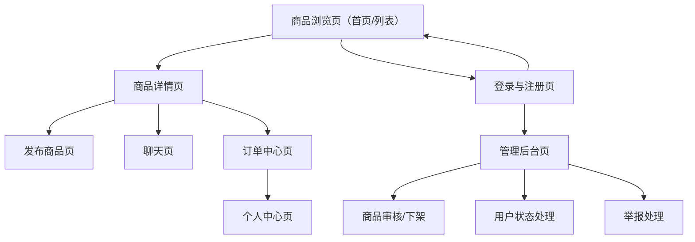

## 1. Product Overview
面向校园场景的二手交易平台前端（用户端+管理员端），对接现有 Spring Boot 后端 REST API、JWT 鉴权与 WebSocket(STOMP)。
支持商品发布/审核、担保交易订单流转、即时聊天、评价、举报与基础后台管理。

## 2. Core Features

### 2.1 User Roles
| 角色 | 注册/登录方式 | 核心权限 |
|------|----------------|----------|
| 访客 | 无需登录 | 可浏览商品列表与商品详情（仅 GET /api/items/** 放开） |
| 学生用户 | 注册：POST /api/auth/register；登录：POST /api/auth/login | 可发布商品、下单与订单操作、聊天、评价、举报、查看/编辑个人资料 |
| 管理员 | 使用管理员账号登录（同 /api/auth/login）；需具备角色 ADMIN | 可访问 /api/admin/**：统计、商品审核通过/下架、用户启用/禁用、举报处理 |

### 2.2 Feature Module
本项目前端需求由以下核心页面组成：
1. **商品浏览页（首页/列表）**：商品检索与筛选、分页排序、进入详情。
2. **商品详情页**：查看商品/卖家信息；发起下单、私信、举报。
3. **登录与注册页**：完成账号注册、登录拿到 JWT。
4. **发布商品页**：填写并提交商品信息（提交后进入“等待审核”）。
5. **订单中心页**：分别查看买家订单/卖家订单；按状态操作（支付、确认、收货、取消）；完成后可评价。
6. **聊天页**：查看与某用户的历史消息；发送消息（REST 或 WebSocket）。
7. **个人中心页**：查看与编辑个人资料。
8. **管理后台页**：统计概览；按状态查看商品并审核/下架；按 ID 处理用户状态与举报。

### 2.3 Page Details
| Page Name | Module Name | Feature description |
|-----------|-------------|---------------------|
| 商品浏览页 | 搜索筛选与列表 | 搜索 keyword、筛选 category/minPrice/maxPrice/publishAfter；分页 page/size；排序 sortBy；点击进入详情（GET /api/items） |
| 商品详情页 | 商品信息展示 | 展示标题、描述、价格、成色、分类、图片、状态、发布时间、卖家昵称/信用分（GET /api/items/{id}） |
| 商品详情页 | 交易/沟通入口 | 发起下单（POST /api/orders）；跳转聊天（/chat/:sellerId）；提交举报（POST /api/reports） |
| 登录与注册页 | 认证 | 注册（学号、昵称、邮箱、手机、密码）；登录（邮箱+密码）；成功后保存 token（POST /api/auth/register、/login） |
| 发布商品页 | 发布表单 | 提交标题/描述/价格/成色/分类/图片URL串；提交后提示“等待审核”（POST /api/items） |
| 订单中心页 | 订单列表 | 分买家/卖家视角；按 status 查询（GET /api/orders/buyer、/seller） |
| 订单中心页 | 订单状态操作 | 买家：支付 pay、收货 buyer-receive、取消 cancel；卖家：确认 seller-confirm；操作后刷新列表（PATCH /api/orders/…） |
| 订单中心页 | 评价 | 对已完成订单提交评价等级与内容（POST /api/reviews） |
| 聊天页 | 历史与发送 | 拉取与某用户的历史（GET /api/chat/history/{userId}）；发送消息（POST /api/chat/send） |
| 聊天页 | 实时消息 | 连接 /ws/chat（SockJS+STOMP）；发送到 /app/chat.send；订阅 /user/queue/messages 接收推送 |
| 个人中心页 | 资料查看/编辑 | 查询当前用户资料（GET /api/users/me）；编辑并保存（PATCH /api/users/me） |
| 管理后台页 | 数据统计 | 展示统计卡片（GET /api/admin/stats） |
| 管理后台页 | 商品审核/下架 | 按 ItemStatus 拉取列表（GET /api/admin/items）；审核通过 approve、下架 offline（PATCH /api/admin/items/{id}/…） |
| 管理后台页 | 用户状态 | 通过用户 ID 启用/禁用账号（PATCH /api/admin/users/{id}/status?enabled=…） |
| 管理后台页 | 举报处理 | 通过举报 ID 处理状态/备注（PATCH /api/admin/reports/{id}?status=…&remark=…） |

## 3. Core Process
**学生用户流程**
1) 访客进入商品浏览页，使用搜索/筛选查看商品列表与详情。\
2) 需要发布/下单/聊天等操作时，跳转登录与注册页完成认证，前端保存 JWT。\
3) 发布商品：填写发布表单 -> 提交 -> 商品进入待审核状态（PENDING_REVIEW）。\
4) 下单与担保交易：在详情页下单 -> 订单“待支付(PENDING_PAYMENT)” -> 支付后“资金暂扣(FUNDS_HELD)” -> 卖家确认“等待买家收货(WAITING_BUYER_RECEIVE)” -> 买家收货“完成(COMPLETED)”。\
5) 沟通：从详情页进入聊天页，拉取历史并发送消息；在线时通过 WebSocket 接收推送。\
6) 评价与举报：交易完成后可评价；发现异常可对商品或用户发起举报。

**管理员流程**
1) 管理员登录后进入管理后台。\
2) 查看统计概览。\
3) 按状态查看商品列表，对待审核商品执行“审核通过”，对违规商品执行“下架”。\
4) 通过输入用户/举报 ID 完成启用禁用与举报处理。

