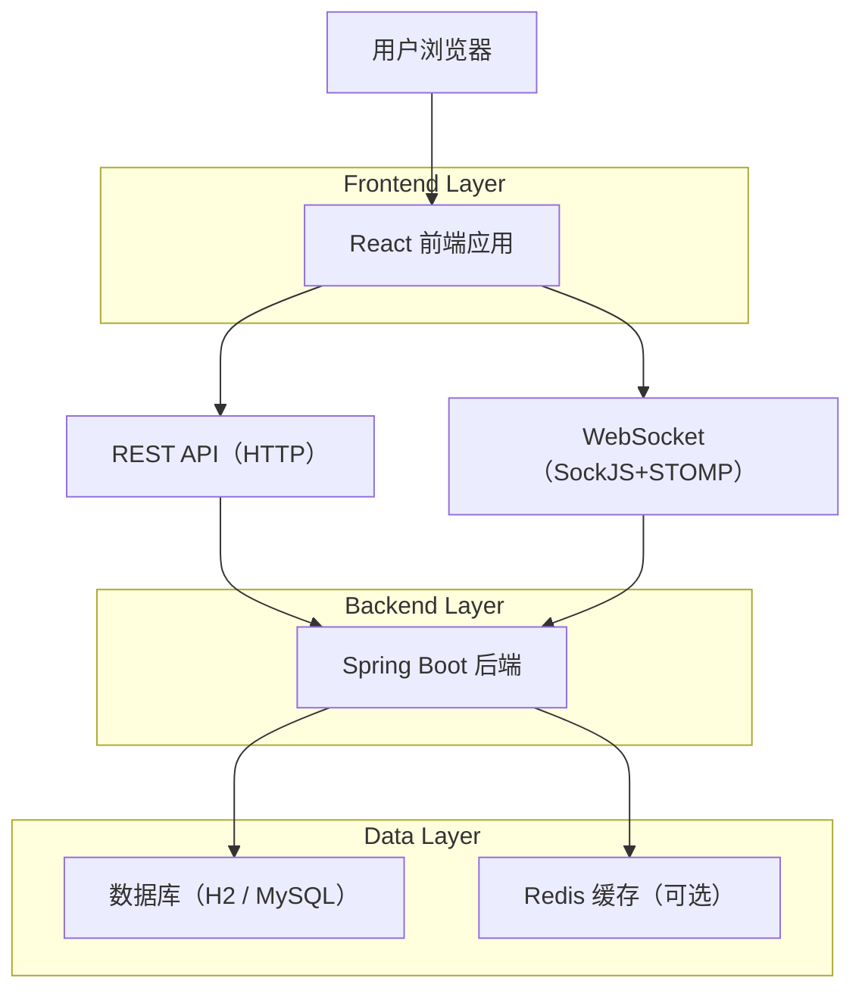

## 1.Architecture design


## 2.Technology Description
- Frontend: React@18 + TypeScript + vite + react-router-dom + axios（或 fetch）
- UI: tailwindcss（或任意组件库）
- Data fetching: TanStack Query（建议，用于分页/缓存/状态同步）
- Realtime: sockjs-client + @stomp/stompjs
- Backend: 既有 Spring Boot 3（REST + WebSocket/STOMP）
- Auth: JWT Bearer Token（后端对 /api/auth/** 放行；GET /api/items/** 放行；/api/admin/** 需 ROLE_ADMIN；其余需登录）

## 3.Route definitions
| Route | Purpose |
|-------|---------|
| / | 商品浏览页（首页/列表） |
| /items/:id | 商品详情页 |
| /auth | 登录/注册（同一页 Tab 切换） |
| /publish | 发布商品（需登录） |
| /orders | 订单中心（需登录） |
| /chat/:peerUserId | 与某用户聊天（需登录） |
| /profile | 个人中心（需登录） |
| /admin/login | 管理员登录（登录后进入后台） |
| /admin | 管理后台（需管理员） |

### 3.1 前端权限守卫（建议）
- Public：/、/items/:id、/auth、/admin/login
- Auth Required：/publish、/orders、/chat/*、/profile
- Admin Required：/admin（以及其子路由）

实现要点：
- 登录成功后保存 token（建议 localStorage + 内存态），所有受保护 API 请求带上 `Authorization: Bearer <token>`。
- 统一处理 401（未登录/过期）-> 跳转 /auth；403（无权限）-> 跳转 / 或展示无权限页。

## 4.API definitions (If it includes backend services)
### 4.1 通用响应封装
```ts
export type ApiResponse<T> = { success: boolean; message: string; data: T };
```

### 4.2 Auth
- `POST /api/auth/register`
- `POST /api/auth/login`

```ts
export type AuthResponse = { userId: number; email: string; token: string };
export type RegisterRequest = { studentNo: string; nickname: string; email: string; phone: string; password: string };
export type LoginRequest = { email: string; password: string };
```

### 4.3 Items
- `GET /api/items`（公开）
- `GET /api/items/{id}`（公开）
- `POST /api/items`（登录）

```ts
export type ItemStatus = 'PENDING_REVIEW'|'ONLINE'|'OFFLINE'|'SOLD';
export type ItemResponse = {
  id: number; title: string; description: string; price: string; conditionLevel: string; category: string;
  imageUrls: string; status: ItemStatus; sellerId: number; sellerNickname: string; sellerCredit: number; createdAt: string;
};
export type CreateItemRequest = { title: string; description: string; price: string; conditionLevel: string; category: string; imageUrls: string };
```

### 4.4 Orders
- `POST /api/orders`（登录）
- `PATCH /api/orders/{orderId}/pay`（登录）
- `PATCH /api/orders/{orderId}/seller-confirm`（登录）
- `PATCH /api/orders/{orderId}/buyer-receive`（登录）
- `PATCH /api/orders/{orderId}/cancel`（登录）
- `GET /api/orders/buyer?status=...`（登录）
- `GET /api/orders/seller?status=...`（登录）

```ts
export type OrderStatus = 'PENDING_PAYMENT'|'FUNDS_HELD'|'WAITING_SELLER_CONFIRM'|'WAITING_BUYER_RECEIVE'|'COMPLETED'|'CANCELED';
export type OrderResponse = { id: number; itemId: number; itemTitle: string; buyerId: number; sellerId: number; amount: string; status: OrderStatus; createdAt: string };
export type CreateOrderRequest = { itemId: number };
```

### 4.5 Chat（REST + WebSocket）
- `GET /api/chat/history/{userId}`（登录）
- `POST /api/chat/send`（登录）
- WebSocket 端点：`/ws/chat`；发送：`/app/chat.send`；订阅：`/user/queue/messages`

```ts
export type ChatMessageRequest = { receiverId: number; itemId?: number; content: string };
export type ChatMessageResponse = { id: number; senderId: number; receiverId: number; itemId?: number|null; content: string; createdAt: string };
```

### 4.6 Reviews / Reports
- `POST /api/reviews`（登录）
- `POST /api/reports`（登录）

```ts
export type RatingLevel = 'GOOD'|'NEUTRAL'|'BAD';
export type CreateReviewRequest = { orderId: number; level: RatingLevel; content: string };
export type CreateReportRequest = { targetUserId?: number; targetItemId?: number; reason: string };
```

### 4.7 Admin（需 ROLE_ADMIN，均在 /api/admin/**）
- `GET /api/admin/stats`
- `GET /api/admin/items?status=...`
- `PATCH /api/admin/items/{id}/approve`
- `PATCH /api/admin/items/{id}/offline`
- `PATCH /api/admin/users/{id}/status?enabled=...`
- `PATCH /api/admin/reports/{id}?status=...&remark=...`

> 说明：后端未提供“用户列表/举报列表”接口，因此后台页面需以“按 ID 操作”或依赖已有列表接口（如商品列表）为主。
